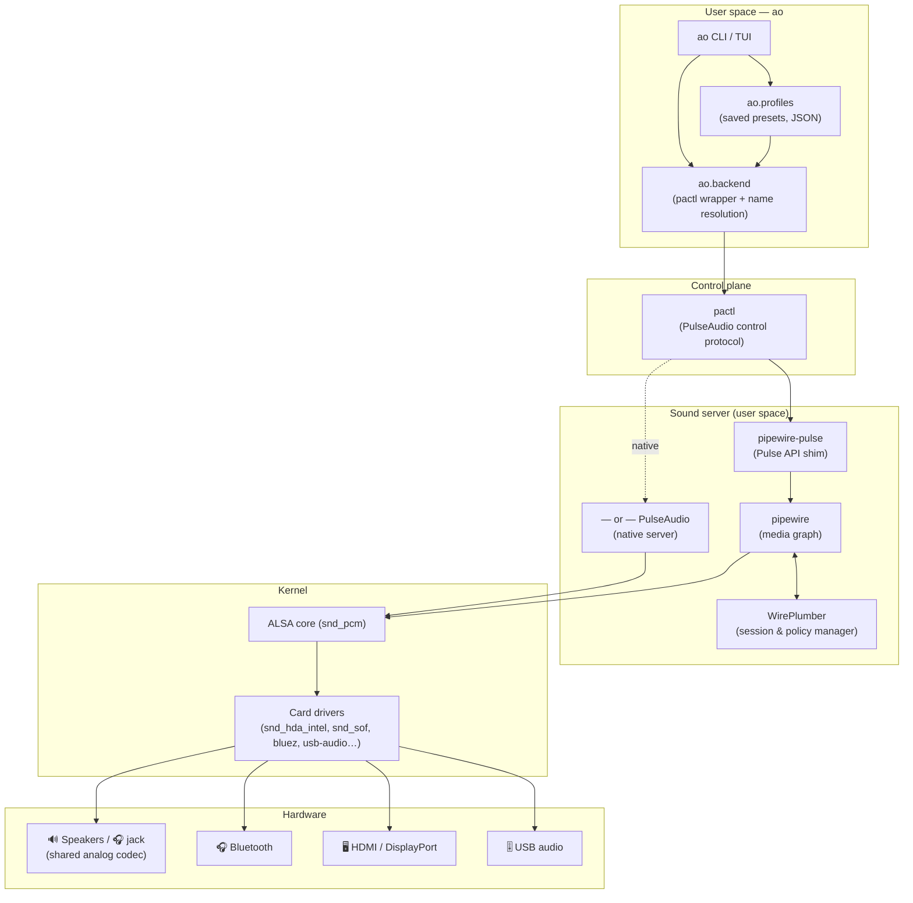
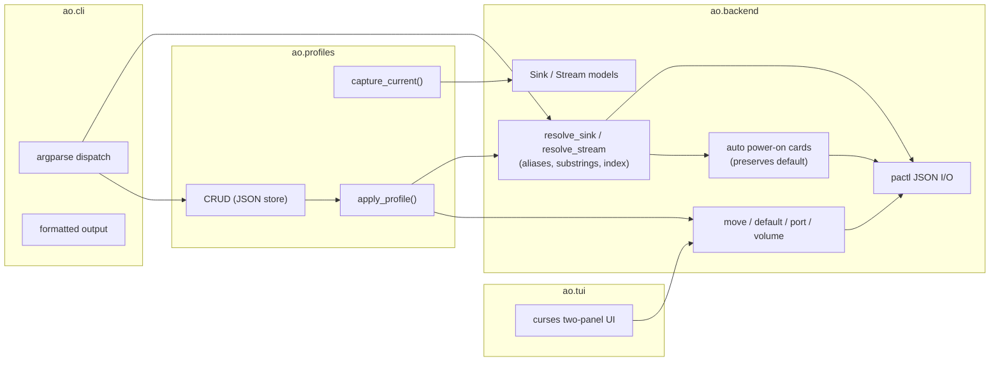

# Architecture

`ao` is a thin, stateless controller on top of the standard Linux audio stack. It does
**not** process audio; it reads state and issues routing commands through `pactl`, the
PulseAudio control client (which also drives PipeWire via `pipewire-pulse`). This keeps
`ao` portable across distributions and across both sound servers.

## Where `ao` sits in the Linux audio stack

From the lowest-level hardware up to the command you type:

**Reading the layers (bottom → top):**

1. **Hardware** — the physical transducers and links (speakers, headphone jack, Bluetooth,
   HDMI, USB audio).
2. **Kernel / ALSA** — drivers expose each output as a PCM device.
3. **Sound server** — PipeWire (with WirePlumber as the policy manager) or native
   PulseAudio builds a graph of *nodes* and decides who connects to whom.
4. **Control plane** — `pactl` speaks the PulseAudio control protocol to the server.
5. **ao** — translates friendly intent ("move mpv to bluetooth") into control commands.

## Internal components

### Key design decisions

| Decision | Rationale |
|----------|-----------|
| Drive `pactl`, not the PipeWire/Pulse C APIs | One code path works on PipeWire *and* PulseAudio; no compiled bindings. |
| Address outputs by **semantic alias** (`bt`, `speakers`, …) | Portable across machines; profiles survive device reconnection. |
| **Never** change the default output as a side effect | The system's "normal" behavior is preserved until the user asks otherwise. |
| Auto power-on a card, then **restore the previous default** | Targeting `speakers` works even if the card was off, without hijacking output. |
| No daemon; one-shot commands + on-demand profile apply | Predictable; nothing runs in the background unexpectedly. |
