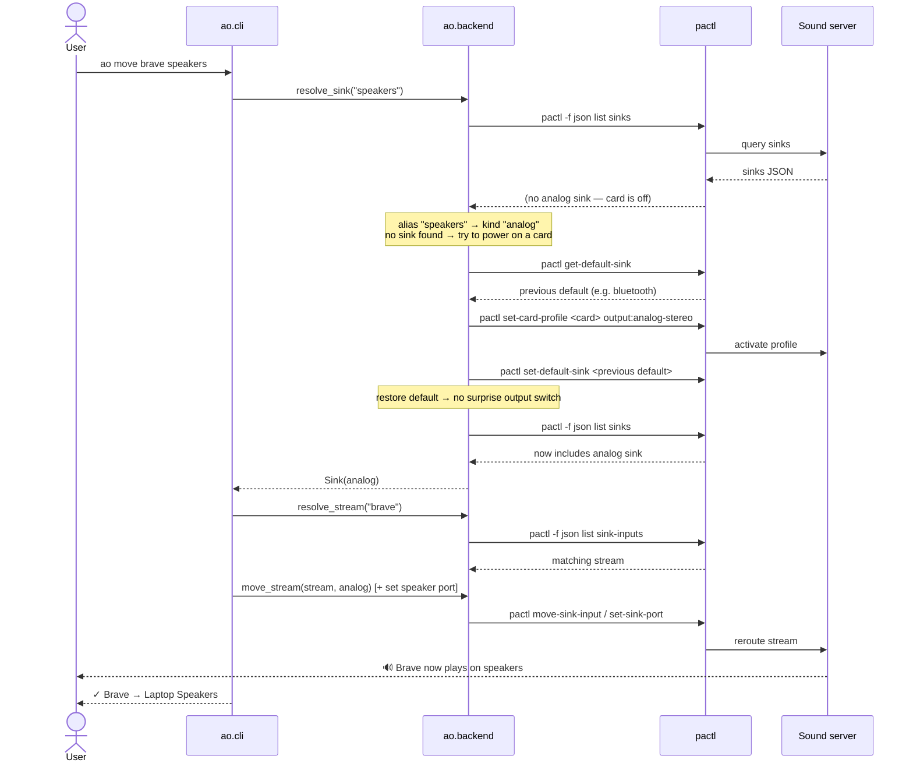
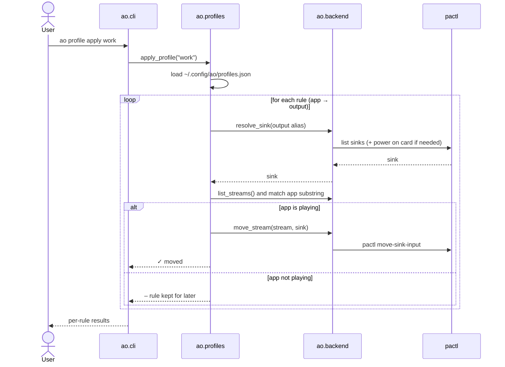

# Sequences

Step-by-step behavior of the two most important operations.

## 1. Moving one application to an output

Example: `ao move brave speakers`, where the analog card is currently **off**.

The important detail is the **save/restore of the default sink**: powering on a card would
normally make the session manager promote the new device to default. `ao` restores the
prior default so the global routing of *other* apps does not change.

## 2. Applying a saved profile

Example: `ao profile apply work`, with rules `brave=speakers`, `slack=bt`.

Profiles only act on streams that are currently playing; rules for apps that are not
running are reported and kept, ready for next time.
