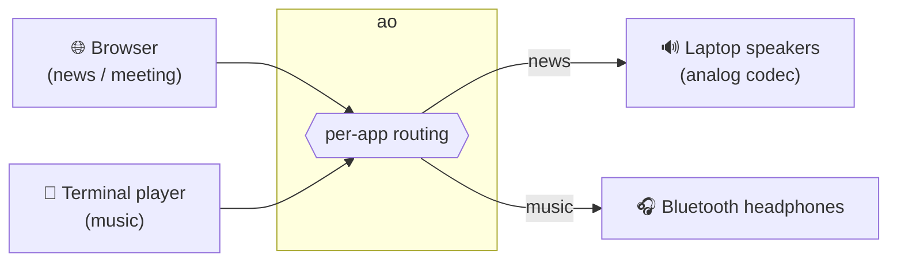
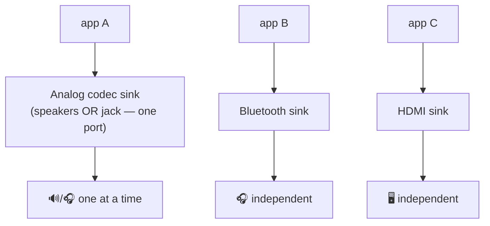

# Representative use case

## Scenario: split work and music across two outputs

You are working with two audio sources at once:

- A **browser** (Brave/Chrome/Firefox) playing a news video or a meeting.
- A **terminal music player** (mpv, ncspot, cmus…) playing music.

You want the **music in your Bluetooth headphones** and the **browser audio on the laptop
speakers**, so colleagues nearby can hear the meeting while music stays private — and you
want this to be one quick command, repeatable every day.



### Step by step

```bash
# 1. See what's playing and where
ao list

# 2. Route each source (aliases, not long device names)
ao move mpv bt           # music → Bluetooth headphones
ao move brave speakers   # browser → laptop speakers (powers on the card if needed)

# 3. Save it as a reusable profile
ao profile save work brave=speakers mpv=bt

# Next day, with both apps playing, one command restores the split:
ao profile apply work
```

Or capture whatever you have set up right now:

```bash
ao profile save work     # snapshot current app→output mapping
```

### Why this is safe

- `ao` moves **only** the two streams you named. It does **not** change the default output,
  so any *other* app keeps using the system's normal output.
- Outputs are stored as portable aliases (`bt`, `speakers`), so the same `work` profile
  also works on a different laptop or after the headphones reconnect with a new address.

## Hardware reality check

On most laptops the **internal speakers and the wired headphone jack share one codec**, so
they cannot play different apps simultaneously — `ao speakers` / `ao headphones` switch the
active port instead. Real multiplexing happens across **independent devices**:



`ao` makes routing across these independent devices a two-key or one-command operation.
